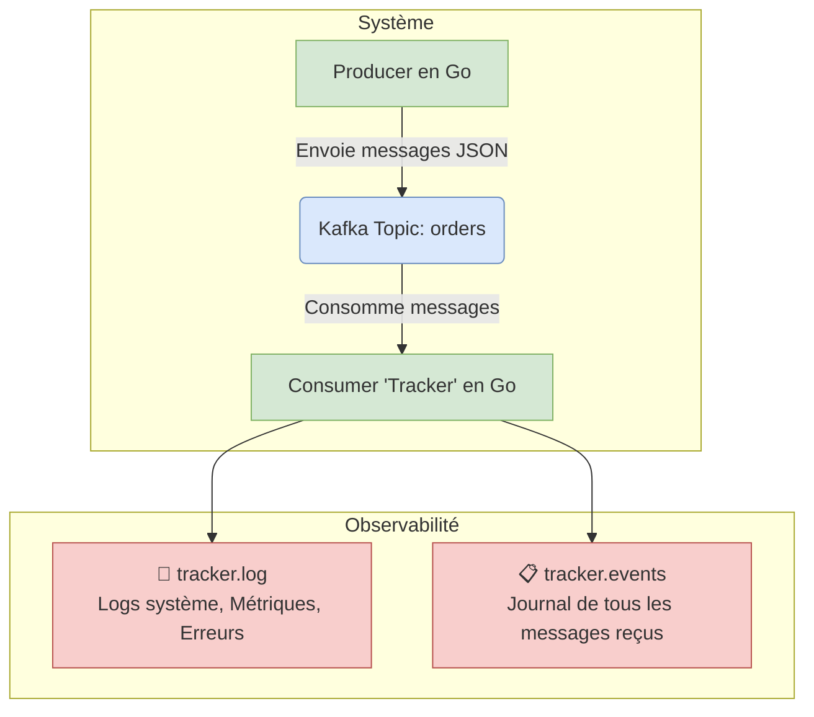

# Projet de Démonstration Kafka avec Go

Ce projet est une démonstration d'un système de messagerie basé sur Apache Kafka, entièrement conteneurisé avec Docker. Il illustre un cas d'utilisation fondamental avec le patron "Event Carried State Transfer" : un producteur qui génère des commandes enrichies et un consommateur qui les traite de manière autonome.

## Architecture

L'architecture est simple et découplée. Le producteur envoie des messages contenant un état complet, permettant au consommateur de fonctionner sans dépendances externes.



-   **Producteur (`producer.go`)** : Génère des commandes simulées avec un état complet (infos client, inventaire) et les envoie au topic Kafka.
-   **Apache Kafka** : Broker de messages, tournant dans un conteneur Docker. Version `confluentinc/cp-kafka:7.8.3`.
-   **Consommateur (`tracker.go`)** : S'abonne au topic, reçoit les commandes et les traite. Il maintient une double journalisation pour l'observabilité et la traçabilité.

## Prérequis

-   **Docker** & **Docker Compose**
-   **Go 1.22+**
-   Optionnel : `jq` pour une analyse avancée des logs JSON.

## 🚀 Démarrage Rapide

1.  **Démarrer l'environnement :**
    ```bash
    ./start.sh
    ```
    Ce script lance Kafka, crée le topic, et exécute le producteur et le consommateur.

2.  **Observer les journaux :**
    Ouvrez deux autres terminaux pour suivre les journaux en temps réel :
    ```bash
    # Suivre les logs système (métriques, erreurs)
    tail -f tracker.log | jq

    # Suivre tous les messages entrants
    tail -f tracker.events | jq
    ```

3.  **Arrêter l'environnement :**
    ```bash
    ./stop.sh
    ```
    Ce script arrête proprement les applications Go, puis les conteneurs Docker.

## Observabilité et Journalisation

Le système utilise une stratégie de journalisation à deux fichiers pour séparer les préoccupations :

1.  **`tracker.log` : Journal d'Observabilité Système**
    -   **Quoi ?** Événements de cycle de vie (démarrage, arrêt), métriques périodiques, et erreurs critiques.
    -   **Pourquoi ?** Pour le **monitoring** et l'**alerte**. Ce fichier est concis et contient les indicateurs de santé du système.
    -   **Format** : JSON structuré.

2.  **`tracker.events` : Journal de Traçabilité des Messages**
    -   **Quoi ?** Une copie de **chaque message** reçu de Kafka, qu'il soit valide ou non.
    -   **Pourquoi ?** Pour l'**audit**, le **débogage** et la **relecture** d'événements. Il garantit qu'aucune donnée entrante n'est perdue.
    -   **Format** : JSON, avec le message brut, les métadonnées Kafka et le résultat de la désérialisation.

### Analyse des Journaux

Un script est fourni pour une analyse rapide. Rendez-le exécutable et lancez-le :

```bash
chmod +x analyze_logs.sh
./analyze_logs.sh
```

#### Exemples d'Analyse avec `jq`

`jq` est un outil puissant pour exploiter les journaux JSON.

-   **Voir les erreurs système :**
    ```bash
    jq 'select(.level == "ERROR")' tracker.log
    ```

-   **Reconstruire l'historique d'une commande (depuis `tracker.events`) :**
    ```bash
    jq 'select(.deserialized == true and .order_full.order_id == "VOTRE_ID")' tracker.events
    ```

-   **Compter les messages par statut de commande :**
    ```bash
    jq -r 'select(.deserialized == true) | .order_full.status' tracker.events | sort | uniq -c
    ```

-   **Suivre l'évolution du débit de messages (depuis `tracker.log`) :**
    ```bash
    jq -r 'select(.message == "Métriques système périodiques") | [.timestamp, .metadata.messages_per_second] | @csv' tracker.log
    ```

## Structure du Code

-   **`order.go`** : Définit le modèle de données partagé (`Order`, `CustomerInfo`, etc.) utilisé par le producteur et le consommateur.
-   **`producer.go`** : Le code source du producteur.
-   **`tracker.go`** : Le code source du consommateur.
-   **`docker-compose.yaml`** : Définit le service Kafka.
-   **`start.sh` / `stop.sh`** : Scripts pour gérer le cycle de vie de l'application.
-   **`analyze_logs.sh`** : Script pour l'analyse des journaux.
-   **`go.mod` / `go.sum`** : Fichiers de dépendances Go.

## Commandes Kafka Utiles

-   **Lister les topics :**
    ```bash
    docker exec kafka kafka-topics --bootstrap-server localhost:9092 --list
    ```

-   **Consommer les messages depuis le terminal (pour le débogage) :**
    ```bash
    docker exec kafka kafka-console-consumer --bootstrap-server localhost:9092 --topic orders --from-beginning
    ```
